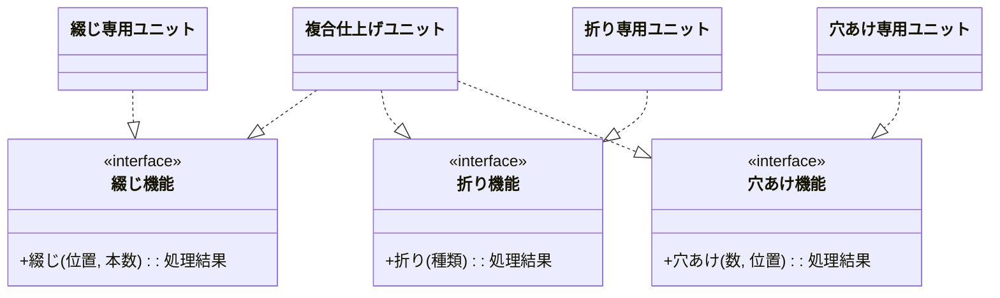
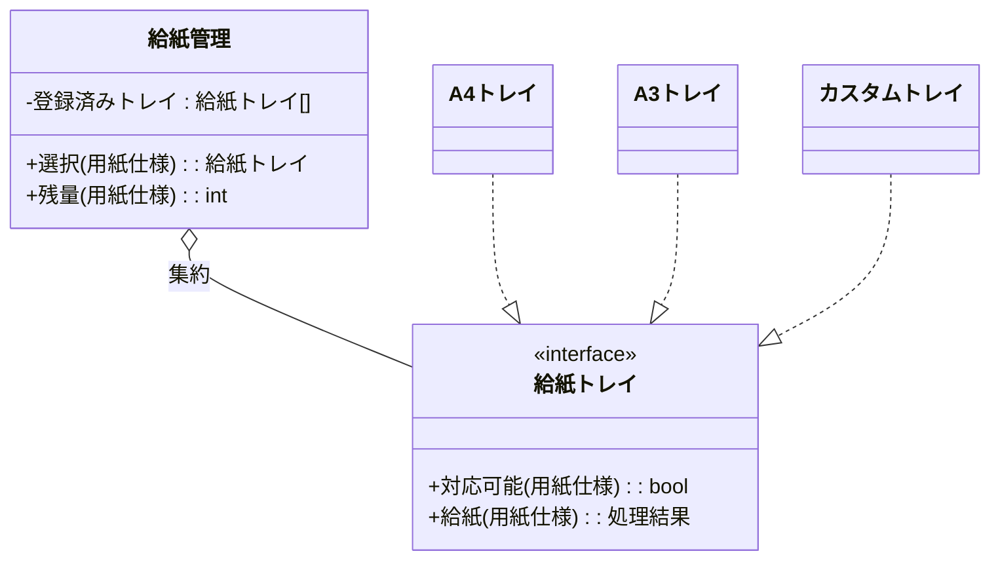
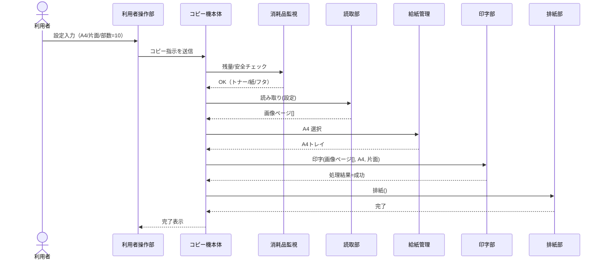
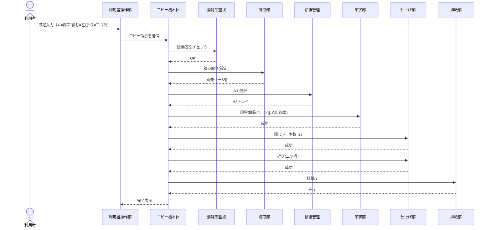
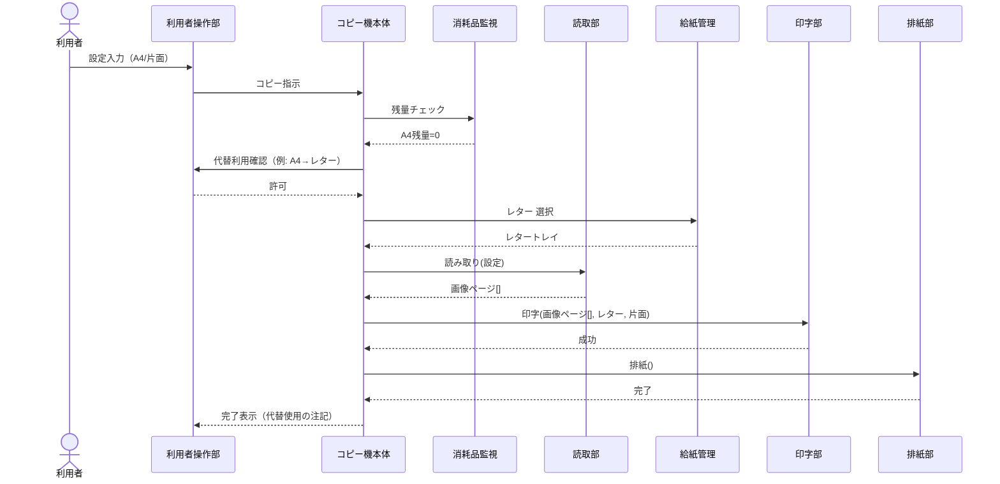

# コピー機設計資料（完全版：クラス仕様・設計意図・図面付き）

## 0. 設計の目的

* 変更要求（紙サイズ追加、仕上げ機能追加、通信方式変更）を**既存の本体を修正せず**に吸収する。
* **壊さずに足す**（OCP）、**抽象に依存**（DIP）、**置換可能**（LSP）、**一職務**（SRP）、**小さな契約**（ISP）を具体化する教材モデル。

---

## 1. 設計全体像

* **コピー機本体**は「ジョブの流れ（読み取り→印字→後処理）」だけを統括。
* **周辺ユニット**（給紙、印字方式、仕上げ、通信、認証…）は**抽象契約**を満たす実装として差し替え・追加可能。
* 依存方向は**本体 → 抽象**に限定（具象名は知らない）。

---

## 2. 用語・値オブジェクト

* **コピー指示**：原稿設定・出力設定・仕上げ設定の束。
* **画像ページ**：読み取り結果のページデータ。
* **用紙仕様**：サイズ（A4/A3/カスタム）、紙厚、種類。
* **処理結果**：成功/失敗とエラー情報。

---

## 3. クラス設計（日本語表記）

### 3.1 本体と主要抽象

* **コピー機本体**

  * 責務：コピー指示の受理、セーフティ確認、部品への指示、進行管理。
  * 依存：**読取部／印字部／給紙管理／排紙部／（任意）仕上げ部／利用者操作部／消耗品監視／（任意）通信部／（任意）セキュリティ部**。
  * ポリシー：**具象名を知らない**（依存性逆転）。

* **読取部**（抽象）

  * 読み取り(設定) → 画像ページ[]
  * 実装例：原稿台スキャナ／自動送りスキャナ。

* **印字部**（抽象）

  * 印字(画像ページ[], 用紙仕様, 両面?) → 処理結果
  * 実装例：レーザー印字部／インクジェット印字部。

* **給紙トレイ**（抽象）

  * 対応?(用紙仕様) → bool、給紙(用紙仕様) → 処理結果
  * 実装例：A4トレイ／A3トレイ／カスタムトレイ。

* **給紙管理**（抽象）

  * 選択(用紙仕様) → 給紙トレイ、残量(用紙仕様) → int（枚）。

* **排紙部**（抽象）

  * 排紙() → 処理結果
  * 実装例：標準排紙／大容量排紙。

* **仕上げ部**（抽象）

  * 綴じ(位置, 本数)／折り(種類)／穴あけ(数, 位置) → 各 処理結果
  * ISP分割案：綴じ機能／折り機能／穴あけ機能を個別IFに。

* **利用者操作部**（抽象）

  * 入力取得() → コピー指示、状態表示(メッセージ)、確認(プロンプト) → bool。

* **消耗品監視**（抽象）

  * 残量取得(資材) → int、閾値到達?() → bool。

* **通信部**（抽象, 任意）

  * 送信(宛先, データ) → 処理結果、ジョブ受信() → コピー指示。

* **セキュリティ部**（抽象, 任意）

  * 認証(利用者) → bool、監査記録(イベント)。

---

## 4. 設計ルール（Architecture Constraints）

1. **依存方向**：本体→抽象のみ（DIP）。
2. **置換可能性**：抽象契約の前後条件を満たす実装は相互置換（LSP）。
3. **単一責任**：各クラスは一職務に限定（SRP）。
4. **インターフェース分離**：不要なメソッドを持たせない（ISP）。
5. **拡張方法**：新機能は**新実装の追加＋登録**で導入（OCP）。

---

## 5. クラス図（Mermaid）

### 5.1 全体クラス図（中核と抽象・拡張の関係）

```mermaid
classDiagram
%% ============== 中核（本体） ==============
class コピー機本体 {
  +電源オン()
  +電源オフ()
  +コピー実行(コピー指示)
  +スキャン送信(コピー指示, 宛先)
  +状態取得()
}

%% ============== 値オブジェクト/データ型 ==============
class コピー指示 {
  +原稿設定
  +出力設定
  +仕上げ設定
}
class 画像ページ
class 用紙仕様 {
  +サイズ
  +紙厚
  +種類
}
class 処理結果 {
  +結果区分
  +エラー情報
}

%% ============== 抽象インターフェース群 ==============
class 読取部 {
  <<interface>>
  +読み取り(設定) : 画像ページ[]
}

class 印字部 {
  <<interface>>
  +印字(画像ページ[], 用紙仕様, 両面設定) : 処理結果
}

class 給紙トレイ {
  <<interface>>
  +対応可能(用紙仕様) : bool
  +給紙(用紙仕様) : 処理結果
}

class 給紙管理 {
  <<interface>>
  +選択(用紙仕様) : 給紙トレイ
  +残量(用紙仕様) : int
}

class 排紙部 {
  <<interface>>
  +排紙() : 処理結果
}

class 仕上げ部 {
  <<interface>>
  +綴じ(位置, 本数) : 処理結果
  +折り(種類) : 処理結果
  +穴あけ(数, 位置) : 処理結果
}

class 利用者操作部 {
  <<interface>>
  +入力取得() : コピー指示
  +状態表示(メッセージ)
  +確認(プロンプト) : bool
}

class 消耗品監視 {
  <<interface>>
  +残量取得(資材) : int
  +閾値到達判定() : bool
}

class 通信部 {
  <<interface>>
  +送信(宛先, データ) : 処理結果
  +ジョブ受信() : コピー指示
}

class セキュリティ部 {
  <<interface>>
  +認証(利用者) : bool
  +監査記録(イベント)
}

%% ============== 具象実装の例 ==============
class 原稿台スキャナ
class 自動送りスキャナ
class レーザー印字部
class インクジェット印字部
class A4トレイ
class A3トレイ
class カスタムトレイ
class 標準排紙
class 大容量排紙
class 綴じユニット
class 折りユニット
class 穴あけユニット
class タッチパネルUI
class ネットワーク通信
class 社内認証モジュール

%% ============== 本体→抽象 依存（DIP） ==============
コピー機本体 --> 読取部 : 依存
コピー機本体 --> 印字部 : 依存
コピー機本体 --> 給紙管理 : 依存
コピー機本体 --> 排紙部 : 依存
コピー機本体 --> 仕上げ部 : 任意依存
コピー機本体 --> 利用者操作部 : 依存
コピー機本体 --> 消耗品監視 : 依存
コピー機本体 --> 通信部 : 任意依存
コピー機本体 --> セキュリティ部 : 任意依存
コピー機本体 --> コピー指示 : 入力
読取部 ..> 画像ページ : 生成
印字部 ..> 用紙仕様 : 参照
印字部 ..> 画像ページ : 消費
コピー機本体 ..> 処理結果 : 返却

%% ============== 実装（LSP/置換可能） ==============
原稿台スキャナ ..|> 読取部
自動送りスキャナ ..|> 読取部

レーザー印字部 ..|> 印字部
インクジェット印字部 ..|> 印字部

A4トレイ ..|> 給紙トレイ
A3トレイ ..|> 給紙トレイ
カスタムトレイ ..|> 給紙トレイ

標準排紙 ..|> 排紙部
大容量排紙 ..|> 排紙部

綴じユニット ..|> 仕上げ部
折りユニット ..|> 仕上げ部
穴あけユニット ..|> 仕上げ部

タッチパネルUI ..|> 利用者操作部
ネットワーク通信 ..|> 通信部
社内認証モジュール ..|> セキュリティ部
```

### 5.2 仕上げ部のインターフェース分離（ISPの具体化）

### 5.3 給紙周りの責務分担（SRP・OCPの具体化）

---

## 6. シーケンス図（Mermaid）

### 6.1 UC-01：通常コピー（A4片面）

### 6.2 UC-02：冊子印刷（A3 両面 + 綴じ + 二つ折り）

### 6.3 UC-03：在庫切れフォールバック（A4欠品→代替許容時）

---

## 7. 拡張・運用指針

* **新サイズ対応**：新しい「給紙トレイ実装」を追加・登録（本体は無変更）。
* **新仕上げ機能**：仕上げ部の新実装（またはISP分割した専用機能）を追加。
* **印字方式の変更**：印字部の実装を差し替え（レーザー→インクジェット等）。
* **通信・認証**：通信部／セキュリティ部を“任意依存”として後付け。

---

## 8. テスト戦略

* **契約テスト**：各トレイ実装が `対応?→給紙成功` を満たすか。
* **置換テスト**：印字部（レーザー⇄インクジェット）を差し替えても出力品質が許容範囲内。
* **互換テスト**：新仕上げ追加後、既存ユースケース（UC-01/02）が回る。
* **障害注入**：紙詰まり／過熱／残量ゼロでのUI誘導と復旧手順。

---

## 9. 設計上の判断（抜粋）

* **仕上げ部の分割**：綴じ・折り・穴あけを別契約に（ISP）。複合機はアダプタで合成。
* **用紙仕様の抽象化**：サイズ・厚み・種類を属性化し、カスタム紙で拡張（OCP）。
* **構成ベース依存注入**：起動時に抽象実装を挿し込む構成（DIP）。

---

## 10. まとめ

* **本体は抽象だけを知る** → 部品は入れ替え自由（DIP/LSP）。
* **新機能は追加で導入** → 本体は不変（OCP）。
* **各部は一職務** → 変更の波及を局所化（SRP/ISP）。

> 以上を「コピー機」という具体物に写すことで、AI時代にも錆びない設計判断を学べる。記事本文では要点を示し、詳細は本資料に委譲する構成を推奨します。
